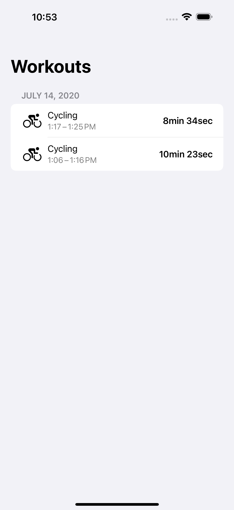
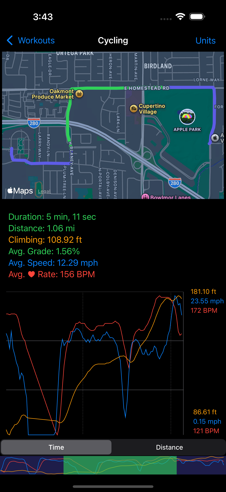
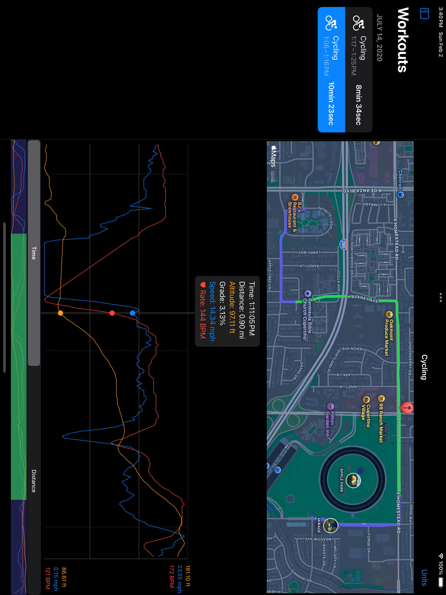

## WorkoutSpot

WorkoutSpot is an app to get statistics about a point or segment of a workout in HealthKit.

For a given point in a workout, view:
- location on a map
- time
- distance
- altitude
- grade
- calculated speed
- heart rate
- power

For a given segment of a workout, view:
- route on a map
- duration
- distance
- climb distance
- average grade
- average calculated speed
- average heart rate
- average power

Visualize the calculated speed, altitude, heart rate, and power with a graph over a segment.
Change the segment selection by zooming and scrolling on the graph.

### Screenshots

[More screenshots](Screenshots/)
